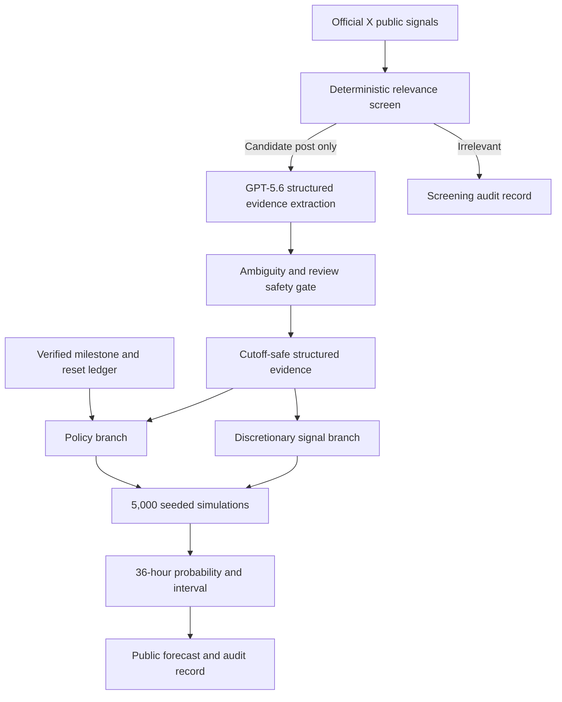

<div align="center">


# SACRED FORECAST

### WILL TIBO RESET?

An explainable 36-hour Codex reset-risk forecast built from public signals, milestone policy, GPT-5.6-assisted evidence extraction, and a policy-aware simulation model.

Plan expensive agent work with an auditable probability range—not rumors and not another token counter.

<p>
  
  
  
</p>

**[Live Forecast](https://tiboreset.vercel.app)** · **[Public Data Lab](https://tiboreset.vercel.app/lab/data)** · **[Demo Mode Setup](#judge-quick-start)** · **[Technical Method](#how-it-works)**

<sub>Unofficial experimental project. Not affiliated with or endorsed by OpenAI or X.</sub>

</div>

## Problem

Codex users work within limited usage capacity. Reset timing can determine whether to spend remaining quota on a large agent run, save it for critical work, or queue the task. The available clues are fragmented across public posts, milestone announcements, operational signals, and reset history. Sacred Forecast turns those clues into a transparent risk estimate rather than presenting rumor as certainty.

## Solution

Sacred Forecast provides:

| Capability | What it gives the user |
| --- | --- |
| Public-signal monitoring | Incremental, deduplicated posts from the configured official X account |
| Structured extraction | Reviewable evidence fields from candidate posts; irrelevant posts are screened locally |
| Policy-aware forecast | Separate milestone-policy and discretionary-signal risk branches |
| Seeded uncertainty | 5,000 reproducible simulations and a credible probability interval |
| Quota planning | Deterministic guidance for spending, saving, or queueing Codex work |
| Audit trail | Evidence IDs, feature origins, coefficients, cutoff, seed, model version, and configuration hash |
| Historical evaluation | A strict, six-hour walk-forward backtest with announcement posts excluded from pre-announcement scoring |
| Public Data Lab | Read-only source, extraction, milestone, forecast, and resource records |

## Product tour

The following submission snapshots were captured from the deployed product on 17 July 2026. Forecast values are point-in-time records, not hardcoded promises.

### 1. The current 36-hour answer


The hero reconciles to the same stored forecast snapshot used by the charts and diagnostics.

### 2. Policy risk and signal risk remain separate


The interface shows which causal branch drives the combined probability instead of hiding the calculation behind one number.

### 3. Fresh public evidence stays inspectable


Each stored post exposes its screening state and forecast impact; ordinary irrelevant posts do not move the model.

### 4. Milestone history preserves announcement type


Full, banked, and scheduled announcements remain distinct. The historical ledger does not invent execution timestamps.

### 5. The technical record is public


The Data Lab is a read-only judge and developer surface; operational controls remain hidden and protected.

## How it works



**GPT-5.6 extracts evidence; it does not calculate the forecast.** The final probability is calculated by Reset Oracle v2 in pure TypeScript. OpenAI extraction uses the Responses API with a strict Zod-backed output schema. If OpenAI is unavailable, Demo Mode uses a labeled deterministic heuristic and Live ingestion can fall back safely.

## Reset Oracle v2

Reset Oracle v2 models two causes independently:

```text
P(policy reset)
  = P(next pledged milestone arrives within 36 hours)
    × P(reset announcement | pledged milestone)

P(total reset)
  = 1 - (1 - P(policy reset)) × (1 - P(discretionary reset))
```

- **Milestone arrival pressure:** a cutoff-safe, recency-aware log-normal renewal mixture estimates conditional arrival from verified inter-milestone durations. It never treats `current milestone / target milestone` as a live user-count measurement.
- **Policy posterior:** a Beta-Binomial posterior starts at `Beta(1,1)` and updates only from pledged milestones known before the cutoff, retaining full, banked, scheduled, and announcement-only outcomes.
- **Discretionary branch:** six-hour logistic hazards combine explicit wording, commitments, incidents, capacity pressure, promotions, launches, polls, recency, reliability, and ambiguity using versioned expert-prior coefficients.
- **Cooldown correction:** recent-reset suppression applies only to discretionary risk. It cannot suppress a policy-triggered reset when milestones arrive on consecutive days.
- **Ambiguity protection:** jokes, questions, metaphors, uncertain claims, and conditional wording require review and receive zero automatic public impact.
- **Reproducibility:** 5,000 seeded simulations sample interval, regime-weight, policy-posterior, and discretionary-coefficient uncertainty. The seed, count, configuration hash, cutoff, and evidence IDs are retained with each forecast.

The coefficients are expert priors, not statistically trained parameters. See [Forecasting Model](docs/FORECASTING_MODEL.md) and [Limitations](docs/LIMITATIONS.md).

## One-month walk-forward backtest

The primary evaluation excludes each target announcement post and scores only information available before publication.

| Measure | Strict pre-announcement result |
| --- | ---: |
| Evaluation period | 17 Jun–17 Jul 2026 |
| Six-hour forecasts generated | 120 |
| Scored windows | 115 |
| Right-censored windows | 5 |
| Verified reset announcements | 4 |
| Reset Oracle v1 Brier score | 0.1522 |
| Reset Oracle v2 Brier score | **0.1127** |
| Constant base-rate Brier score | 0.1320 |
| v2 Brier skill vs. constant | +0.1463 |
| Events crossing 30% before announcement | 2 of 4 |
| Events crossing 50% before announcement | 1 of 4 |
| Highest observed false-alarm probability | 5.1% |

Observed lead time was 19.6 hours above 30% before the 8M announcement. Before the 9M announcement, v2 crossed 30% 52.2 hours early and 50% 28.2 hours early. The 6M and 7M announcements did not reach 30% in advance.

> **Promising but unvalidated.** V2 beat v1 and the constant baseline in this cached month, but four announcements cannot establish general reliability. Historical simulation, not a guarantee of future resets.

Read the [v2 model report](artifacts/backtests/2026-06-17_2026-07-17/v2/MODEL_V2_REPORT.md), [comparison metrics](artifacts/backtests/2026-06-17_2026-07-17/v2/v1-v2-comparison.json), and [original v1 report](artifacts/backtests/2026-06-17_2026-07-17/BACKTEST_REPORT.md). Raw acquisition and extraction caches are intentionally not published.

## Built with Codex and GPT-5.6

### Codex during development

Codex was used across the implementation lifecycle: repository construction, schema and API work, deterministic model code, Vitest and Playwright coverage, production debugging, ambiguity-safety backfill, mobile overflow auditing, the one-month walk-forward evaluation, Reset Oracle v2 implementation, and final documentation and deployment preparation.

### GPT-5.6 at runtime

For candidate posts only, the configured OpenAI model converts public text into strict, reviewable fields such as event type, reset type, milestone denominator, confidence, evidence excerpts, uncertainties, and review status. The local relevance screen avoids API calls for obvious irrelevant posts. A deterministic safety layer prevents ambiguous evidence from changing the forecast automatically.

The language model never outputs the final probability. Reset Oracle does.

## Judge quick start

No credentials are required:

```bash
git clone https://github.com/9natthaphong/tiboreset.git
cd tiboreset
npm ci
npm run dev:demo
```

Open [http://localhost:3000](http://localhost:3000). Demo posts, emails, and forecasts are explicitly labeled synthetic. The local demo also enables `/control-room` for the offline confirmation, threshold-crossing, deduplication, and reset-alert flow; `/lab/data` remains read-only.

Recommended judge path:

1. Scroll through the cinematic reveal and read the 36-hour probability.
2. Open **Signals** and **Advanced Diagnostics** to inspect the two model branches.
3. Review **Latest Signals** and the verified reset ledger.
4. Open the [public Data Lab](https://tiboreset.vercel.app/lab/data).
5. In Demo Mode, use `/control-room` to inject a signal and inspect the Demo Email outbox.

## Run and verify

| Command | Purpose |
| --- | --- |
| `npm run dev:demo` | Offline, no-credential judge experience |
| `npm run dev` | Standard Next.js development server |
| `npm test` | Unit and integration tests |
| `npm run typecheck` | Strict TypeScript validation |
| `npm run lint` | ESLint validation |
| `npm run build` | Production build |
| `npm run test:e2e` | Full Playwright suite |
| `npm run backtest:month:v2` | Re-run v2 only when the private local historical cache is available |

<details>
<summary><strong>Live Mode setup</strong></summary>

1. Copy `.env.example` to `.env.local` and set `NEXT_PUBLIC_APP_MODE=live`.
2. Apply `supabase/migrations` in order; keep the service-role key server-only.
3. Configure the official X API bearer token. Initial activation reads at most 10 posts; later ingestion uses `since_id` only.
4. Configure `OPENAI_API_KEY` and `OPENAI_MODEL` for structured extraction.
5. Set independent `CRON_SECRET` and `ADMIN_SECRET` values. Keep `CONTROL_ROOM_ENABLED=false` in production unless an operator explicitly needs it.
6. Configure Resend only if live double-opt-in email delivery is desired.

The deployed health endpoint reported email delivery **disabled** during the submission audit on 17 Jul 2026, so this README does not claim that production alerts are operational. See [Live Setup](docs/LIVE_SETUP.md).

</details>

<details>
<summary><strong>Architecture and security notes</strong></summary>

- Next.js App Router and strict TypeScript; Recharts for charts and GSAP/ScrollTrigger for the cinematic hero.
- Official X API adapter only—no browser scraping or unofficial mirrors.
- Supabase Postgres stores live posts, extractions, milestones, forecasts, contributions, ingestion runs, subscriptions, and delivery state. Public tables use RLS; service-role access stays server-side.
- Every successful ingestion run recalculates time-dependent v2 risk. A new snapshot is saved only for material probability/interval movement, alert-band or model/configuration changes, or hourly freshness.
- Supabase Realtime refreshes new forecast inserts; visible-tab fallback polling runs every five minutes with focus refresh, overlap prevention, and exponential error backoff.
- Historical seed files are human-reviewed and schema-validated. LLM output cannot create or modify them.
- Production Control Room is hidden unless explicitly enabled and every mutation remains protected by timing-safe admin authorization.

</details>

## Documentation

[Architecture](docs/ARCHITECTURE.md) · [Forecasting model](docs/FORECASTING_MODEL.md) · [Data provenance](docs/DATA_PROVENANCE.md) · [Demo script](docs/DEMO_SCRIPT.md) · [Live setup](docs/LIVE_SETUP.md) · [Privacy](docs/PRIVACY.md) · [Submission brief](docs/BUILD_WEEK_SUBMISSION.md)

## Disclaimer

Sacred Forecast / TiboReset is an unofficial experimental project. It is not affiliated with or endorsed by OpenAI or X. Forecasts are probabilistic planning aids, not official announcements or promises about account-level rollout.
