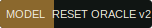
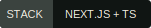
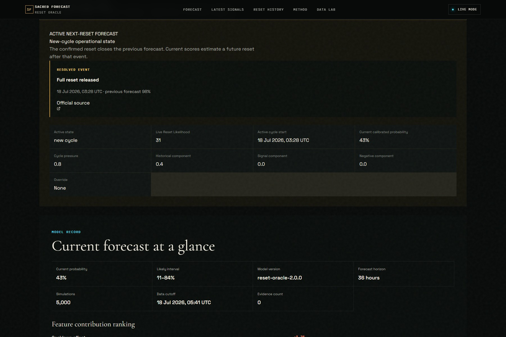
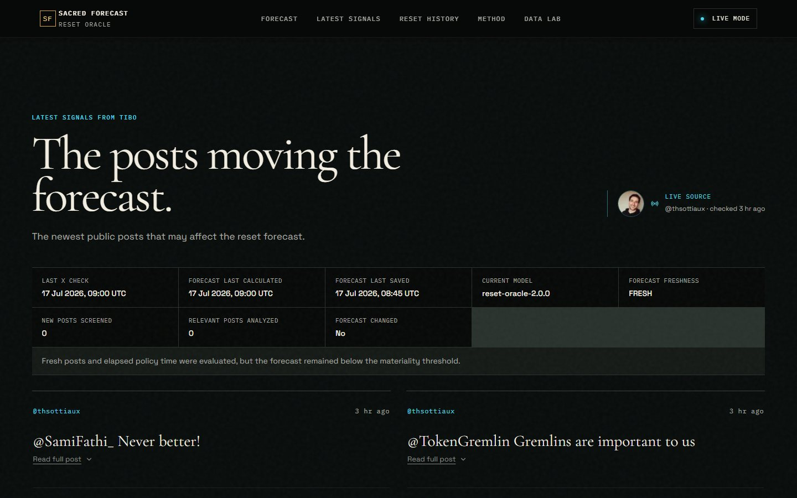
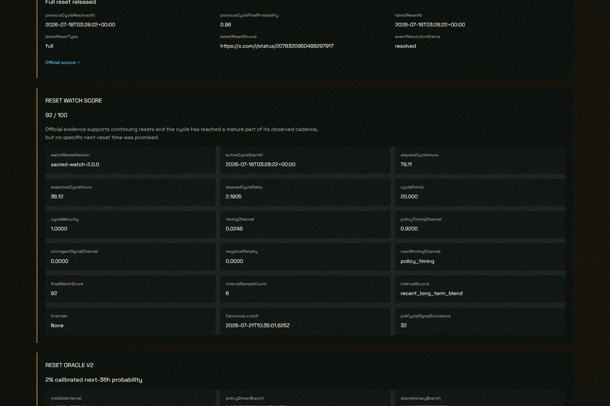
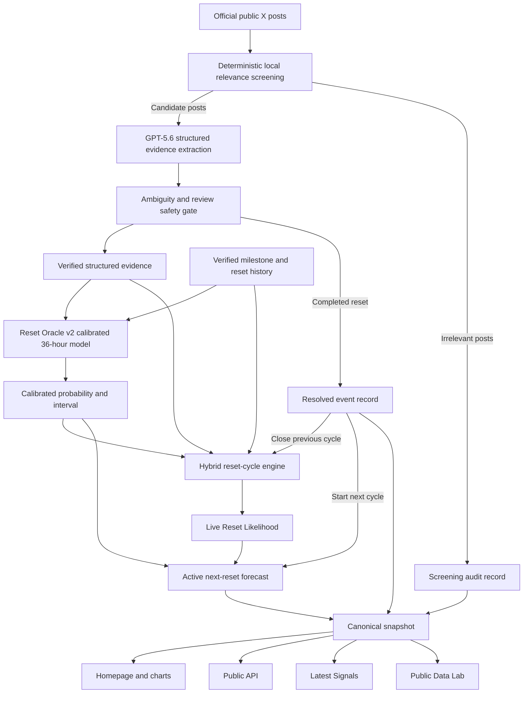

<div align="center">


# SACRED FORECAST

### WILL TIBO RESET?

Sacred Forecast combines a cycle-aware Live Reset Likelihood with Reset Oracle v2's calibrated 36-hour probability. GPT-5.6 structures public evidence, while deterministic TypeScript calculates both metrics and preserves a public audit trail.

Know when to spend, save, or queue expensive Codex work without mistaking rumor for certainty.

<p>
  
  
  
</p>

**[Live Forecast](https://tiboreset.vercel.app)** · **[Public Data Lab](https://tiboreset.vercel.app/lab/data)** · **[Demo Mode Setup](#judge-quick-start)** · **[Technical Method](#how-it-works)**

<sub>Unofficial experimental project. Not affiliated with or endorsed by OpenAI or X.</sub>

</div>

## Problem

Codex users work within limited usage capacity. Reset timing can determine whether to spend remaining quota on a large agent run, save it for critical work, or queue the task. The clues are fragmented across public posts, milestone announcements, operational signals, and reset history. Sacred Forecast turns those clues into transparent, inspectable planning signals rather than presenting rumor as certainty.

## Solution

| Capability | What it gives the user |
| --- | --- |
| Live Reset Likelihood | A primary, cycle-aware operational score from 30–98; it is not statistically calibrated |
| Continuing-policy regime | A clear official statement that resets will continue creates a seven-day, non-stacking score floor with no implied timing |
| Reset Oracle v2 | A separate calibrated probability of an official reset announcement inside the next rolling 36 hours |
| Public-signal monitoring | Incremental, deduplicated posts from the configured official X account |
| Structured extraction | Reviewable evidence from candidate posts; obvious irrelevant posts are screened locally |
| Seeded uncertainty | 5,000 reproducible simulations and a credible interval for the calibrated model |
| Quota planning | Deterministic guidance for spending, saving, or queueing Codex work |
| Audit trail | Evidence, feature origins, coefficients, cutoff, seed, model version, and configuration hash |
| Historical evaluation | A strict six-hour walk-forward backtest of Reset Oracle v2, excluding target announcement posts from pre-announcement scoring |
| Public Data Lab | Read-only resolved-event, active-cycle, source, extraction, forecast, and resource records |

### Two metrics, two questions

- **Live Reset Likelihood** asks how elevated the overall reset situation appears now. It combines cycle timing, verified history, Reset Oracle v2, and structured current signals. It is an operational score, not a calibrated probability, and is not included in the historical Brier-score comparison.
- **Calibrated 36-hour probability** asks how likely Reset Oracle v2 estimates an official reset announcement is inside the next rolling 36 hours. It retains its credible interval, cutoff, model version, deterministic seed, and evidence provenance.

## Product tour

These point-in-time images were captured from the current production deployment on 18 July 2026. Dynamic values may continue to change as the active cycle advances.

### 1. A completed reset starts the next cycle


A confirmed reset closes the previous forecast and immediately starts a new operational cycle at a 30% baseline.

### 2. The two metrics remain separate



The operational likelihood follows the reset cycle; the calibrated model retains its own horizon, interval, cutoff, simulation count, and feature record.

### 3. Active and excluded evidence stay inspectable



Forecast-moving and Screened out tabs keep active evidence visible while preserving irrelevant, expired, review-blocked, and previous-cycle posts for audit. Contributions are model-derived—not literal probability-point additions.

### 4. The calibrated trend preserves the resolved event


The resolved 98% point remains historical evidence. The chart then separates the active forecast for another future reset rather than treating the completed event as current risk.

### 5. The technical record separates past and future



The Data Lab distinguishes the resolved event from the active next-reset forecast, including cycle cutoff, excluded evidence, component values, and model provenance.

## How it works



**GPT-5.6 produces evidence, not either final metric.** Reset Oracle v2 calculates the calibrated probability, while the separately versioned hybrid reset-cycle engine calculates Live Reset Likelihood. Both are deterministic TypeScript consumers of the reviewed evidence record.

### Reset-cycle resolution

1. An official completed-reset announcement resolves the previous forecast.
2. Its source, reset type, timestamp, and previous resolved state remain auditable.
3. The completed event is excluded from the next-cycle signal score.
4. Transient evidence posted before the reset contributes zero to the new active cycle. A still-current official policy-continuation regime can cross the boundary because it describes future resets rather than the completed event.
5. A new cycle begins immediately from an operational baseline of 30.
6. The active snapshot then estimates another future reset.

## Reset Oracle v2

Reset Oracle v2 models two causes independently:

```text
P(policy reset)
  = P(next pledged milestone arrives within 36 hours)
    × P(reset announcement | pledged milestone)

P(total reset)
  = 1 - (1 - P(policy reset)) × (1 - P(discretionary reset))
```

- **Milestone arrival pressure:** a cutoff-safe, recency-aware log-normal renewal mixture estimates conditional arrival from verified inter-milestone durations.
- **Policy posterior:** a Beta-Binomial posterior starts at `Beta(1,1)` and updates only from pledged milestones known before the cutoff.
- **Discretionary branch:** six-hour logistic hazards combine structured signals using versioned expert-prior coefficients.
- **Cooldown correction:** recent-reset suppression affects discretionary risk, not policy-triggered milestones.
- **Ambiguity protection:** jokes, questions, metaphors, uncertain claims, and conditional wording receive zero automatic impact.
- **Reproducibility:** 5,000 seeded simulations retain the seed, count, configuration hash, cutoff, and evidence IDs.

The coefficients are expert priors, not statistically trained parameters. See [Forecasting Model](docs/FORECASTING_MODEL.md) and [Limitations](docs/LIMITATIONS.md).

## One-month walk-forward backtest

This evaluation applies to Reset Oracle v2 only. The operational hybrid score has not been added to the Brier-score comparison.

| Measure | Strict pre-announcement result |
| --- | ---: |
| Evaluation period | 17 June–17 July 2026 |
| Six-hour forecasts generated | 120 |
| Scored windows | 115 |
| Verified reset announcements | 4 |
| Reset Oracle v1 Brier score | 0.1522 |
| Reset Oracle v2 Brier score | **0.1127** |
| Constant base-rate Brier score | 0.1320 |
| v2 Brier skill vs. constant | **+14.63%** |
| Events crossing 30% before publication | 2 of 4 |
| Events crossing 50% before publication | 1 of 4 |
| Highest observed false-alarm probability | 5.1% |

Observed lead time was 19.6 hours above 30% before the 8M announcement. Before the 9M announcement, v2 crossed 30% 52.2 hours early and 50% 28.2 hours early. The 6M and 7M announcements did not reach 30% in advance.

> **Promising but unvalidated.** V2 beat v1 and the constant baseline in this cached month, but four announcements cannot establish general reliability. Historical simulation, not a guarantee of future resets.

Read the [v2 model report](artifacts/backtests/2026-06-17_2026-07-17/v2/MODEL_V2_REPORT.md), [comparison metrics](artifacts/backtests/2026-06-17_2026-07-17/v2/v1-v2-comparison.json), and [original v1 report](artifacts/backtests/2026-06-17_2026-07-17/BACKTEST_REPORT.md). Raw acquisition and extraction caches are intentionally not published.

## Built with Codex and GPT-5.6

### Codex during development

Codex was used for repository implementation, schema and API work, deterministic model code, testing, production debugging, ambiguity-safety work, responsive hardening, the one-month walk-forward evaluation, Reset Oracle v2, the hybrid cycle engine, documentation, and deployment preparation.

### GPT-5.6 at runtime

For candidate posts only, GPT-5.6 converts public text into strict, reviewable fields such as event type, reset type, confidence, evidence excerpts, uncertainties, and review status. The local relevance screen avoids model calls for obvious irrelevant posts, and a deterministic safety layer prevents ambiguous evidence from changing either metric automatically.

GPT-5.6 never outputs Live Reset Likelihood or the calibrated probability. Deterministic TypeScript calculates both.

### Long-lived reset policy

An explicit official statement that resets will continue is classified as `reset_policy_continuation`, not a hint, near-term commitment, or confirmation. Sacred Likelihood 1.1 keeps the newest compatible statement at full strength for 72 hours, decays it until seven-day expiry, and lets a contradictory official statement supersede it immediately. A fresh high-confidence statement creates a score floor near 60, but policy continuation alone cannot exceed 80 because it provides no timing. These durations and bounds are transparent expert product priors, not statistically learned parameters.

## Judge quick start

No credentials are required:

```bash
git clone https://github.com/9natthaphong/tiboreset.git
cd tiboreset
npm ci
npm run dev:demo
```

Open [http://localhost:3000](http://localhost:3000). Demo posts and forecasts are explicitly labeled synthetic. Demo Mode demonstrates the product architecture offline; its fixture state should not be mistaken for the current production reset event.

Recommended production judge path:

1. Start with **Reset Released** and the immediately active new cycle.
2. Compare **Live Reset Likelihood** with **Reset Oracle v2's calibrated 36-hour probability**.
3. Switch between **Forecast-moving** and **Screened out**.
4. Review the calibrated trend and its resolved-event marker.
5. Expand policy and signal diagnostics, then inspect the four-event backtest limitation.
6. Open the [public Data Lab](https://tiboreset.vercel.app/lab/data) to compare the resolved event with the active next-reset forecast.

## Run and verify

| Command | Purpose |
| --- | --- |
| `npm run dev:demo` | Offline, no-credential judge experience |
| `npm run dev` | Standard Next.js development server |
| `npm test` | Unit and integration tests |
| `npm run typecheck` | Strict TypeScript validation |
| `npm run lint` | ESLint validation |
| `npm run build` | Production build |
| `npm run test:e2e` | Full Playwright suite |
| `npm run backtest:month:v2` | Re-run v2 only when the private local historical cache is available |

<details>
<summary><strong>Live Mode setup</strong></summary>

1. Copy `.env.example` to `.env.local` and set `NEXT_PUBLIC_APP_MODE=live`.
2. Apply `supabase/migrations` in order; keep the service-role key server-only.
3. Configure the official X API bearer token. Initial activation reads at most 10 posts; later ingestion uses `since_id` only.
4. Configure `OPENAI_API_KEY` and `OPENAI_MODEL` for structured extraction.
5. Set independent `CRON_SECRET` and `ADMIN_SECRET` values. Keep `CONTROL_ROOM_ENABLED=false` in production unless an operator explicitly needs it.

See [Live Setup](docs/LIVE_SETUP.md).

</details>

<details>
<summary><strong>Architecture and security notes</strong></summary>

- Next.js App Router and strict TypeScript; Recharts for charts and GSAP/ScrollTrigger for the cinematic hero.
- Official X API adapter only—no browser scraping or unofficial mirrors.
- Supabase Postgres stores live posts, extractions, milestones, forecasts, contributions, ingestion runs, and audit state. Public tables use RLS; service-role access stays server-side.
- The canonical snapshot keeps the homepage, charts, API, Latest Signals, and Data Lab synchronized.
- Historical seed files are human-reviewed and schema-validated. LLM output cannot create or modify them.
- Production Control Room is hidden unless explicitly enabled and every mutation remains protected by timing-safe admin authorization.

</details>

## Documentation

[Architecture](docs/ARCHITECTURE.md) · [Forecasting model](docs/FORECASTING_MODEL.md) · [Data provenance](docs/DATA_PROVENANCE.md) · [Demo script](docs/DEMO_SCRIPT.md) · [Live setup](docs/LIVE_SETUP.md) · [Privacy](docs/PRIVACY.md) · [Submission brief](docs/BUILD_WEEK_SUBMISSION.md)

## Disclaimer

Sacred Forecast / TiboReset is an unofficial experimental project. It is not affiliated with or endorsed by OpenAI or X. Its metrics are planning aids, not official announcements or promises about account-level rollout.
